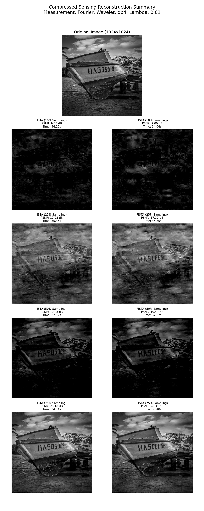

# Image Reconstruction via Compressed Sensing

[](https://opensource.org/licenses/MIT)


## Overview

This project explores the principles and application of Compressed Sensing (CS) for reconstructing 2D grayscale images from significantly fewer measurements than required by traditional Nyquist-Shannon sampling theory. CS leverages the inherent sparsity of natural images in certain transform domains (like Wavelets) to enable high-fidelity recovery from undersampled data. This is particularly valuable in fields like medical imaging (MRI), radio astronomy, and computational photography where data acquisition can be costly or time-consuming.

This implementation focuses on solving the LASSO (Least Absolute Shrinkage and Selection Operator) optimization problem, a common formulation in CS, using iterative proximal gradient methods.

## Example Results

The script generates a summary plot showing the original image and reconstructions for different algorithms and sampling rates. Below is an example for Fourier measurements:



Original image source: [Victor Crespo on Unsplash](https://unsplash.com/photos/a-black-and-white-photo-of-two-boats-FeuL_GAoSWQ)

Read the [report](misc/report.pdf) for more details on the results and analysis.

## Objectives

*   Implement image reconstruction algorithms based on the LASSO formulation:
    $$ \min_x \frac{1}{2}||Ax - y||_2^2 + \lambda||x||_1 $$
    where $x$ represents the image (often in a sparse basis), $y$ are the measurements, $A$ is the measurement operator, and $\lambda$ is the regularization parameter.
*   Implement and compare two popular first-order optimization algorithms:
    1.  **ISTA** (Iterative Shrinkage-Thresholding Algorithm)
    2.  **FISTA** (Fast Iterative Shrinkage-Thresholding Algorithm)
*   Evaluate reconstruction performance using different measurement operators (Random Gaussian, Partial Fourier).
*   Analyze the trade-off between the number of measurements (sampling rate) and the quality of the reconstructed image (PSNR).
*   Visualize convergence behavior and reconstruction results.

## Features

*   Implementation of ISTA and FISTA algorithms for LASSO.
*   Support for different measurement operators:
    *   Random Gaussian matrices
    *   Partial Fourier measurements (simulating undersampled k-space)
*   Use of Wavelet transform (via PyWavelets) as the sparsifying basis $\Psi$. The optimization is performed on the wavelet coefficients $s$, where $x = \Psi s$.
*   Evaluation using Peak Signal-to-Noise Ratio (PSNR) and computation time.
*   Generation of convergence plots (objective function vs. iteration).
*   Visualization of original and reconstructed images.
*   Configurable parameters (image size, sampling rates, measurement type, regularization strength, algorithm settings).

## Project Structure

```
compressed-sensing-reconstruction/
├── code
│   ├── algorithms.py       # ISTA and FISTA implementations
│   ├── cs_utils.py         # Helper functions (image loading, PSNR, plotting)
│   ├── main.py             # Main experiment script
│   └── operators.py        # Measurement (A) and Transform (Psi) operators
├── data
│   └── victor-crespo-FeuL_GAoSWQ-unsplash.jpg # Example test image
├── LICENSE                 # Project license (e.g., MIT)
├── misc
│   └── proposal.pdf        # Project proposal document
├── own
│   └── init.md             # Initialization notes
├── pyproject.toml          # Project metadata and dependencies for build systems
├── README.md               # This file
├── results/                # Directory for output images and plots
│   ├── images/             # Saved reconstructed images
│   └── plots/              # Saved convergence and comparison plots
└── uv.lock                 # Lockfile for reproducible dependencies (using uv)
```

## Installation

1.  **Clone the repository:**
    ```bash
    git clone https://github.com/g-nitin/compressed-sensing-reconstruction.git
    cd compressed-sensing-reconstruction
    ```

2.  **Set up a virtual environment:** (Recommended)
    Using `uv` (as indicated by `uv.lock`):
    ```bash
    uv venv
    source .venv/bin/activate  # On Windows use `.venv\Scripts\activate`
    ```
    Alternatively, using standard `venv`:
    ```bash
    python -m venv .venv
    source .venv/bin/activate # On Windows use `.venv\Scripts\activate`
    ```

3.  **Install dependencies:**
    Using `uv`:
    ```bash
    uv sync
    ```

    **Core Dependencies:**
    *   `numpy`: Numerical operations
    *   `scipy`: Scientific computing (used for FFT)
    *   `matplotlib`: Plotting
    *   `scikit-image`: PSNR calculation
    *   `PyWavelets`: Wavelet transforms
    *   `Pillow`: Image loading/saving
    *   `tqdm`: Progress bars

## Usage

1.  **Configure the experiment:**
    Open `code/main.py` and adjust the parameters in the "Configuration" section as needed:
    *   `IMAGE_PATH`: Path to the input image.
    *   `IMAGE_SIZE`: Target size for the image (e.g., `128` for 128x128). Set to `None` to use original size.
    *   `SAMPLING_RATES`: List of sampling rates to test (e.g., `[0.1, 0.25, 0.5]`).
    *   `MEASUREMENT_TYPE`: `'gaussian'` or `'fourier'`.
    *   `WAVELET_NAME`: Wavelet type (e.g., `'db4'`, `'haar'`).
    *   `WAVELET_LEVEL`: Decomposition level (or `None` for automatic).
    *   `WAVELET_MODE`: Signal extension mode for PyWavelets (e.g., `'periodization'`, `'symmetric'`).
    *   `LAMBDA_REG`: Regularization parameter $\lambda$.
    *   `MAX_ITER`, `TOL`: Algorithm stopping criteria.
    *   `USE_BACKTRACKING`: Enable/disable backtracking line search for step size.
    *   `VERBOSE`: Show progress bars and iteration details.

2.  **Run the main script:**
    ```bash
    python code/main.py
    ```

3.  **Check the results:**
    The script will:
    *   Print PSNR and timing results to the console.
    *   Save reconstructed images to the `results/images/` directory.
    *   Save convergence plots and comparison plots to the `results/plots/` directory.
    *   Generate a summary plot comparing reconstructions across algorithms and sampling rates (e.g., `results/plots/summary_reconstructions_fourier.png`).

## License

This project is licensed under the MIT License - see the [LICENSE](LICENSE) file for details.

## Future Work

*   Implement other CS algorithms (e.g., ADMM, Chambolle-Pock).
*   Explore different sparsifying transforms (e.g., DCT, Shearlets, Learned Dictionaries).
*   Incorporate more sophisticated noise models and handling.
*   Experiment with different measurement matrix designs.
*   Extend to color images or video.
*   Apply to real-world datasets (e.g., MRI k-space data).
*   Optimize operator implementations for speed (e.g., using GPU acceleration).
